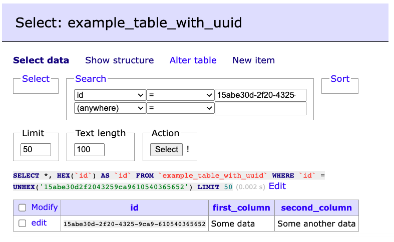

# Uuid support for Adminer
Plugin for [Adminer](https://www.adminer.org/) to convert binary-stored UUIDs to human-readable UUID format.

Tested on **Adminer for MySQL 4.8.1** with MariaDB.
Needs PHP 7.4 or newer.

## Features
- Converts binary-stored UUIDs to human-readable format in Select view.
- Support for search human-readable UUID format in Search section.
- Can be restricted for what columns can be used
  - by table names (reg-ex)
  - by column names (reg-ex)
  - by column types (reg-ex)
  - by column comment (reg-ex)
  - **By default this plugin is applied to all binary(16) columns.**
- Optional conversion to lowercase or uppercase human-readable UUID format.

## Known limitations (future improvements)
- Support for "IN" (multiple IDs) in search & better sanitizing
- Support for quick-edit
- Support for edit

## Screenshot


## Default options
```php
<?php
$options = [
    'convert_to_lowercase' => true,
    'applicable_to' => [
        'table_names' => '/.*/',
        'column_names' => '/.*/',
        'column_types' => '/^binary\(16\)$/i',
        'comments' => '/.*/'
    ],
];
```

## Setup
Due to original [AdminerPlugin](https://raw.githubusercontent.com/vrana/adminer/master/plugins/plugin.php) limitations this plugin needs to extend original Adminer class and then can be used by AdminerPlugin which should extends from this AdminerUuidPlugin.

### Setup without `plugin.php`
1. Download original [adminer.php](https://www.adminer.org/en/#download)
2. Download this plugin
3. Create `index.php` in the same directory with this code:
```php
<?php
function adminer_object() {
    include_once "./AdminerUuidPlugin.php";
    
    return new AdminerUuidPlugin();
}

// Original Adminer
include_once "./adminer.php";
```

### Setup with `plugin.php`
1. Download original [adminer.php](https://www.adminer.org/en/#download)
2. Download original [plugins/plugin.php](https://raw.githubusercontent.com/vrana/adminer/master/plugins/plugin.php)
3. Create `index.php` in the same directory with [code from official Adminer plugin documentation](https://www.adminer.org/en/plugins/).
4. Modify `plugins/plugin.php` to extend it from `AdminerUuidPlugin` instead of `Adminer` itself.
```php
class AdminerPlugin extends AdminerUuidPlugin {
// ...
```
